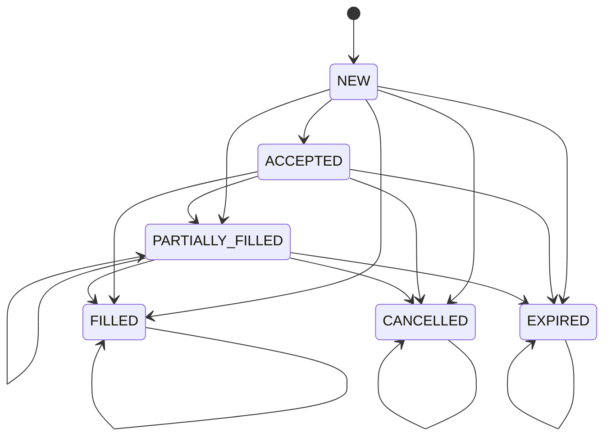

## Option order lifecycle (canonical)

This repo treats **option broker orders** as having a strict lifecycle with a single terminal outcome.

### State diagram

### Broker status mapping (best-effort)

Broker payloads are normalized to canonical states via `backend/execution/order_lifecycle.py`:

- **NEW**: `new`, `pending_new`
- **ACCEPTED**: `accepted`, `replaced`, `pending_replace`, `pending_cancel`
- **PARTIALLY_FILLED**: `partially_filled` (or `filled_qty > 0` but not fully filled)
- **FILLED**: `filled` (or `filled_qty >= qty`)
- **CANCELLED**: `canceled` / `cancelled`
- **EXPIRED**: `expired`

### Partial fills

Some brokers expose **cumulative** `filled_qty` on the order object. The execution engine tracks cumulative fill progress per `broker_order_id` in-memory and writes **incremental deltas** to the ledger/portfolio history to avoid double-counting within a process lifetime.

Relevant code:

- `backend/execution/order_lifecycle.py` (transition rules + validator)
- `backend/execution/engine.py` (`ExecutionEngine` lifecycle tracking + incremental fill delta writes)

